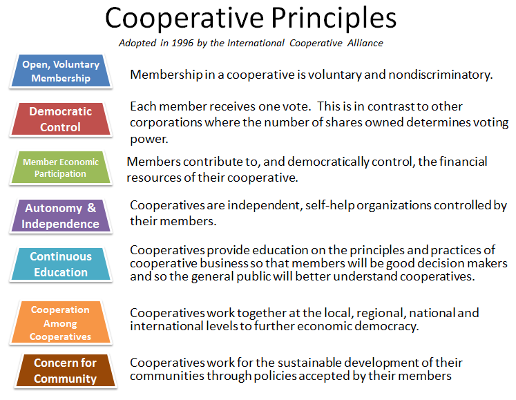

# purpose

#### What the Rules say 

> "The purpose of the Co-operative is to carry out its function as a co-operative and to abide by the internationally recognised co-operative values and principles of co-operative identity as defined by the International Co-operative Alliance. This rule may only be amended by an[ Extraordinary Resolution](voting.md)." 
>
> #### Where the co-operative values and principles came from...



And here are those values and principles, set out below. These are what eccoo has signed up to by becoming a co-operative. How are we doing?

### Our objects 

#### \(Objects is a legal word. It describes eccoo's purpose and activities and is set out in our Rules\)

> "The objects of the Co-operative shall be to carry on the business as a co-operative, in particular by delivering a fair, relationship-centred, co-owned care and support service that matches, supports and develops the users and the givers of the services of the Co-operative. 
>
> Users of the services of the Co-operative may also give paid and voluntary care and support and participate in any other activities which advance the aims of the Co-operative. 
>
> The Co-operative may carry on any other trade, business or service as the Members deem fit."

We know. It's not particularly snappy. But those are the Rules for you. 

